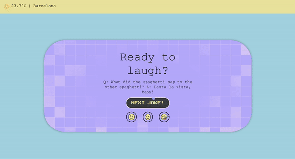

# OfficeDadJokes-Demo

<div align="center"></div>

## Description

This project aims to create a web application that displays jokes to employees before they start their workday.

# Table of Contents

1. [OfficeDadJokes-Demo](#officedadjokes-demo)
2. [Description](#description)
3. [Key Features](#key-features)
4. [Technologies Used](#technologies-used)
5. [API Information](#api-information)
   - [Jokes API 🤡](#jokes-api-)
   - [Weather API ☔️](#weather-api-)
6. [Project Structure](#project-structure)
7. [Project Setup](#project-setup)
   - [Prerequisites](#prerequisites)
   - [Installation](#installation)
   - [Configuration Files](#configuration-files)
     - [Babel Configuration (`babelrc`)](#babel-configuration-babelrc)
     - [TypeScript Configuration (`tsconfig.json`)](#typescript-configuration-tsconfigjson)
   - [Running Tests](#running-tests)
   - [Compiling Sass](#compiling-sass)
8. [Layout Images](#layout-images)
9. [Author](#author)

## Key Features

- **Fetch Jokes from API**
- **Display random Jokes from two different APIs**
- **Joke Rating**
- **Weather Information**

## Technologies Used

    

## API Information

### Jokes API 🤡

- **Random Dad Joke**:

  - URL: `https://icanhazdadjoke.com/`
  - Header: `'Accept': 'application/json'`

- **Chuck Norris Jokes**:
  - URL: `https://api.chucknorris.io/jokes/random`
  - Header: `'Accept': 'application/json'`

### Weather API ☔️

- **Weather API**:
  - URL: `https://www.weatherapi.com/`
  - API Key required.

### Project Structure

```
OfficeDadJokes-Demo/
├── dist/ -> copilation files will appear (TS to JS)
├── node_modules/ -> this will appear when you install it
├── src/
│   ├── APIs/
│   │   ├── jokeFeatures.ts
│   │   └── weatherFeatures.ts
│   ├── IMG/
│   │   ├── layout samples/
│   │   ├── SVG/
│   │   └── background2.png
│   ├── interfaces/
│   │   └── APIsInterfaces.ts
│   ├── styles/
│   │   ├── style.css -> copilation scss to css
│   │   └── style.scss
│   ├── main.ts
│   └── test/
│       └── getFunctions.test.ts
├── .babelrc
├── .gitignore
├── index.html
├── package.json
├── test-results.html -> this will appear when you run tests
└── tsconfig.json
```

## Project Setup

### Prerequisites

- Node.js
- npm (Node Package Manager)

### Installation

1. Clone the repository:

   ```bash
   git clone https://github.com/Luovtyrell/OfficeDadJokes-Demo.git
   cd OfficeDadJokes-Demo
   ```

2. Install dependencies:

   ```bash
   npm install typescript
   npm install bootstrap
   npm install jest
   npm install sass
   ```

### Configuration Files

#### Babel Configuration (`.babelrc`)

```json
{
  "presets": ["@babel/preset-env", "@babel/preset-typescript"]
}
```

#### TypeScript Configuration (`tsconfig.json`)

```json
{
  "compilerOptions": {
    "allowJs": true,
    "checkJs": true,
    "target": "es2016",
    "module": "ESNext",
    "outDir": "./dist",
    "esModuleInterop": true,
    "forceConsistentCasingInFileNames": true,
    "strict": true,
    "skipLibCheck": true
  },
  "include": ["src/**/*.ts"]
}
```

### Running Tests

The project uses Jest for testing. To run tests, use the following command and see the results in your console or `test-results.html`

```bash
npm jest
```

### Compiling Sass

To compile Sass files into CSS, use the following command, then don't forget in `index.html` use your compiled css. For this I used the `watch sass` extension for VSC.

## Layout images

<details>
  <summary>Version 1</summary>


  </details>

<details>
  <summary>Version 2</summary>


  </details>

<details>
  <summary>Version 3</summary>


  </details>

<details>
  <summary>Version 4</summary>


</details>
<details>
  <summary>Final version</summary>


</details>

## Author

- Lucía Mª Ordoñez Vilanova - _React, It Academy_. [@Luovtyrell](https://www.github.com/Luovtyrell)
